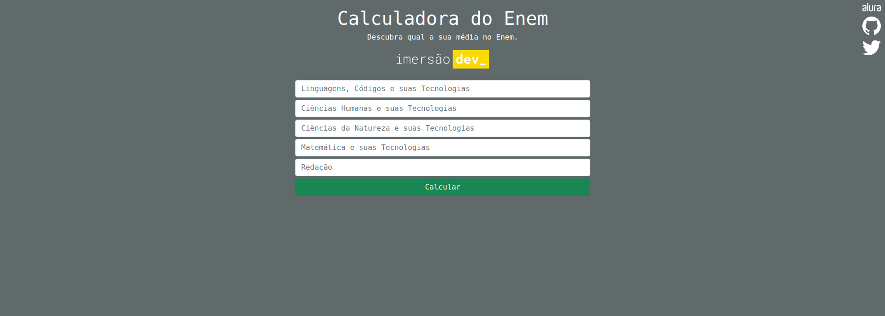

# Aula 01 - Variáveis, operações e média  
  
De acordo com o que foi proposto no primeiro dia, mantive a ideia original de uma calculadora de médias  
porém, utilizei inputs para coletar os dados do usuário e então fazer o cálculo de acordo com as  
matérias do ENEM - Exame Nacional do Ensino Médio.  
  
Foi utilizado no projeto, HTML, CSS, Bootstrap e Javascript.  
  
### Demo

  
  
Live Demo: [Clique aqui](https://netosantanx.github.io/imersaodev/calcularmedia/)  
Codepen: [Clique aqui](https://codepen.io/netosantanx/pen/xxPeLwB)